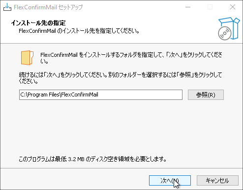
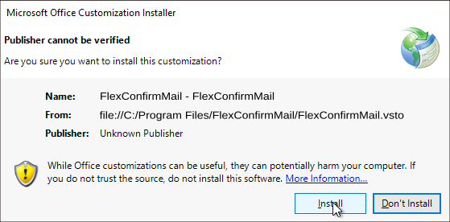
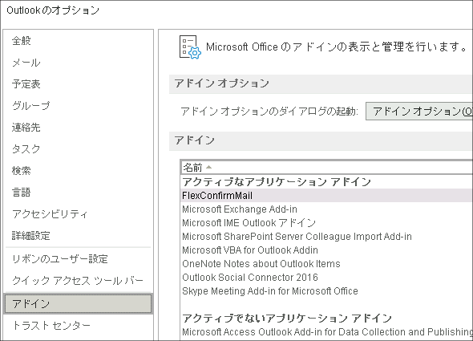
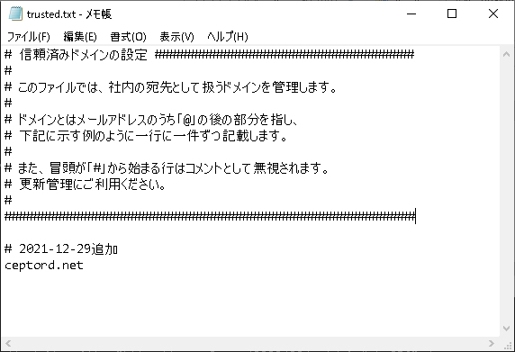
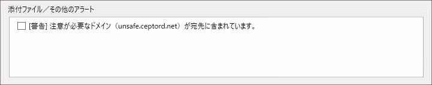
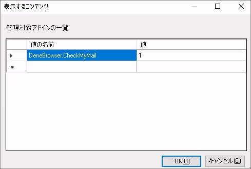

# FlexConfirmMailとは

FlexConfirmMail for Outlook （以下、本文書では FlexConfirmMail と呼びます）は、
誤送信を防止するためのオープンソースのOutlookアドオンです。
送信時に宛先と添付ファイルをダイアログで確認することで、送信ミスを防ぎます。

 * メールの送信時に、宛先と添付ファイルを確認するダイアログを表示します。
 * チェックリスト形式で確認することで送信ミスを防ぎます。
 * 社内ドメインを登録することで、外部の宛先を区別してチェックできます。

## システム要件

FlexConfirmMailは次のシステムをサポートしています。

 | 項目             | サポートバージョン |
 | ---------------- | ------------------ |
 | システム         | Microsoft Windows 7/8/8.1/10 |
 | アプリケーション | Office 2013/2016/2019・Microsoft365デスクトップアプリ |

## ソフトウェアの構成

FlexConfirmMailインストーラには次のファイルが含まれています。

| ファイル                     |  設定内容                           |
| ---------------------------- | ----------------------------------- |
| FlexConfirmMail.dll          | FlexConfirmMail本体                 |
| FlexConfirmMail.dll.manifest | FlexConfirmMailマニフェスト         |
| FlexConfirmMail.vsto         | Outlook向けのアドオン定義           |
| fcm.ico                      | アイコンファイル                    |
| unins000.exe                 | アンインストーラ                    |
| unins000.dat                 | アンインストーラ（データファイル）  |
| Microsoft.Office.Tools.Common.v4.0.Utilities.dll | VSTOアドオンライブラリ |
| Microsoft.Office.Tools.Outlook.v4.0.Utilities.dll | VSTOアドオンライブラリ |

\newpage

# 導入とセットアップ

この章ではFlexConfirmMailのインストール（およびアンインストール）手順を解説します。

## FlexConfirmMailをインストールする

1. 最新のインストーラを取得します。

2. インストーラを実行し、ウィザードを完遂させます。

   {width=400}

3. Outlookを起動します。次のような警告が表示された場合は「インストール」を押下します。

   {width=400}

4. メニューバーの「ファイル」からオプションを選択し、有効なアドオンの一覧にFlexConfirmMailがあることが確認できれば成功です。

   {width=400}

## FlexConfirmMailをアンインストールする

 1. スタートメニューから「プログラムの追加と削除」を起動します。

 2. FlexConfirmMailを選択し「アンインストール」を選択します。

 3. ディレクトリ`C:\ProgramData\FlexConfirmMail`を削除します。

\newpage

# FlexConfirmMailの設定

 * FlexConfirmMailの設定ファイルは`C:\ProgramData\FlexConfirmMail`ディレクトリに配置します。
 * 設定ファイルの文字コードは「UTF-8」のみサポートしています。

## 社内ドメインを設定する

 1. テキストエディタで`C:\ProgramData\FlexConfirmMail\trusted.txt`を開きます。

 2. ファイルに社内の宛先として登録したいドメインを追記します。

    {width=400}

 3. ファイルを保存すれば完了です。

## 特に注意が必要なドメインを設定する

宛先に含まれる場合に、特に注意が必要なドメインの一覧を設定します。

 1. テキストエディタで`C:\ProgramData\FlexConfirmMail\unsafe.txt`を開きます。

 2. ファイルに対象となるドメインを追記します。

 3. ファイルを保存すれば完了です

**警告の例**

{width=450}

\newpage

# よくある質問

## インストーラをサイレント実行したい

組織の端末に配布する時などに、FlexConfirmMailをサイレントインストールしたい場合は、
次のように `/SILENT` オプションを利用します。

```
% FlexConfirmMailSetup.exe /SILENT
```

## アドオンが自動的に無効化されるのを防止したい

Office 2013以降にはパフォーマンスを自動的に最適化する機能が組み込まれており、
その一環としてアドオンを自動的に無効化することがあります。

FlexConfirmMailが自動的に無効化されるのを防止するには、グループポリシーで下記の設定を追加ください。

 1. グループポリシーエディタを開き、「ユーザーの構成」を開く。

 2. 「管理用テンプレート > Microsoft Outlook 2016 > その他」を順番に選択する。

 3. 「管理対象アドオンの一覧」の項目をダブルクリックする。

 4. 設定を「有効」にした上で、オプション欄の「表示」ボタンをクリックする。

 5. 値の名前に`FlexConfirmMail`と入力し、値を`1`に設定する。

    {width=300}

 6. 「OK」ボタンを押下して確定する。

アドオンの自動無効化の詳細は、次のMicrosoftの公式ドキュメントを参照ください。

https://docs.microsoft.com/ja-jp/office/vba/outlook/Concepts/Getting-Started/support-for-keeping-add-ins-enabled
