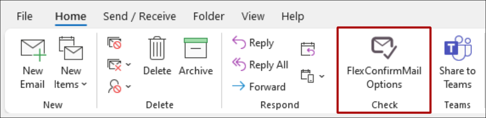
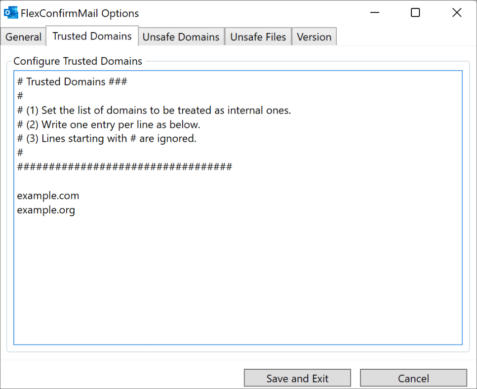
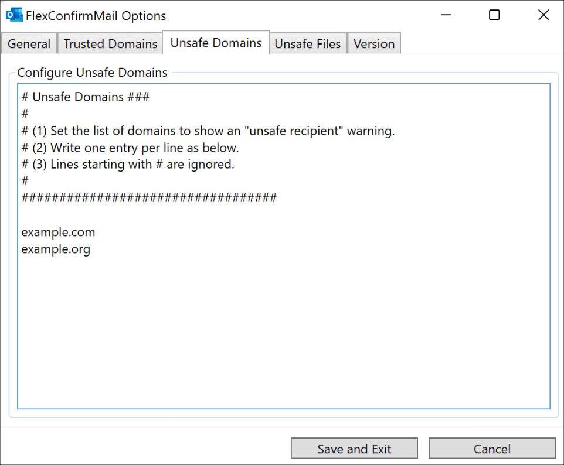
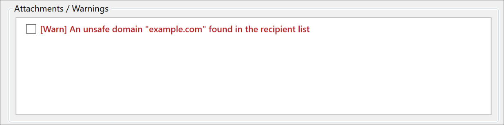
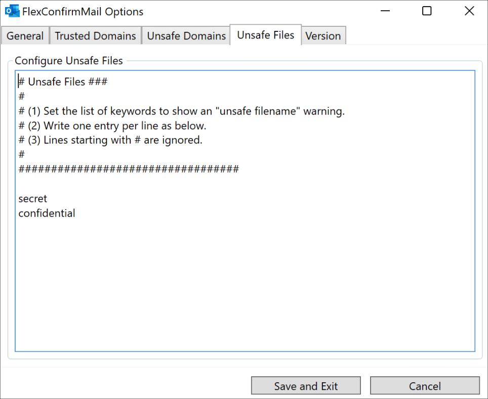
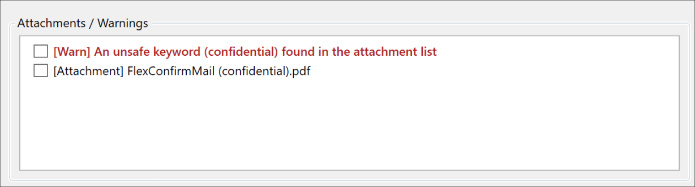

# What is FlexConfirmMail?

FlexConfirmMail for Outlook ("FlexConfirmMail" in this document)
is an open-source Outlook add-in that prevents human errors in
email correspondences.

**Highlights**

 * Show a dialog box to review recipients and attachments when sending a message.
 * Provide an easy-to-follow checklist to help users avoid common mistakes.
 * Almost anything in FlexConfirmMail is tweakable through options.

## System Requirements

FlexConfirmMail supports the following platforms. 

 | Item             | Supported Version  |
 | ---------------- | ------------------ |
 | System           | Microsoft Windows 7/8/8.1/10/11 |
 | Application      | Office 2013/2016/2019, Microsoft365 (Desktop App) |

## List of files in the installer

FlexConfirmMail consists of the following files:

| File                         |  Contents                           |
| ---------------------------- | ----------------------------------- |
| FlexConfirmMail.dll          | FlexConfirmMail                     |
| FlexConfirmMail.dll.manifest | FlexConfirmMail Manifest            |
| FlexConfirmMail.vsto         | Outlook Addin manifest              |
| fcm.ico                      | Icon file                           |
| unins000.exe                 | Uninstaller                         |
| unins000.dat                 | Uninstaller                         |
| Microsoft.Office.Tools.Common.v4.0.Utilities.dll | VSTO library    |
| Microsoft.Office.Tools.Outlook.v4.0.Utilities.dll | VSTO library   |

\newpage

# Installation

This chapter explains how to install (and uninstall) FlexConfirmMail.

## How to install FlexConfirmMail

1. Move FlexConfirmMailSetup.exe to the target machine.

2. Execute the installer and complete the wizard.

   {width=400}

3. Select "file > options" and confirm that FlexConfirmMail is listed as an enabled add-in.

   {width=400}

## How to uninstall FlexConfirmMail

 1. Launch "Add or Remove Programs" on Windows.

 2. Select FlexConfirmMail and choose "Uninstall".

\newpage

# Configuration

 * FlexConfirmMail settings can be changed from the Outlook ribbon icon.

   {width=400}

 * Configuration files are stored in `%AppData%\FlexConfirmMail`.

## How to configure trusted domains

 1. Click "FlexConfirmMail Options" in the Home tab

 2. Open "Trusted Domains" tab, and add domains.

    {width=400}

 3. Click "Save and Exit" to finish the configuration.

## How to configure unsafe domains

Set the list of domains to show "unsafe recipients" warnings.

 1. Click "FlexConfirmMail Options" in the Home tab.

 2. Click "Unsafe Domains", and add domains.

    {width=400}

 3. Click "Save and Exit" to finish the configuration.

**Example**

{width=450}

## How to configure unsafe files

Set the list of keywords to show "unsafe filename" warnings.

 1. Click "FlexConfirmMail Options" in the Home tab.

 2. Click "Unsafe Files", and add keywords.

    {width=450}

 3. Click "Save and Exit" to finish the configuration.

**Example**

{width=450}

\newpage

# FAQ

## How to install FlexConfirmMail silently

If you want to install FlexConfirmMail silently (without showing any dialog),
use `/SILENT` option as follows:

```
% FlexConfirmMailSetup.exe /SILENT
```

## How to prevent FlexConfirmMail being disabled automatically

Office 2013 or later contains an optimization feature that automatically
disables addons detected as being slow.

To prevent FlexConfirmMail from being disabled unexpectedly, please set
the following configuration:

 1. Open Group Policy Editor, and select "User Configuration".

 2. Select "Administrative Template > Microsoft Outlook 2016 > Miscellaneous".

 3. Click "List of managed add-ins".

 4. Enable the configuration and click "Show".

 5. Add `FlexConfirmMail` and set its value to `1`.

    {width=300}

 6. Click "OK".

For more details, please read Microsoft's official documentation:

https://docs.microsoft.com/en-US/office/vba/outlook/Concepts/Getting-Started/support-for-keeping-add-ins-enabled
