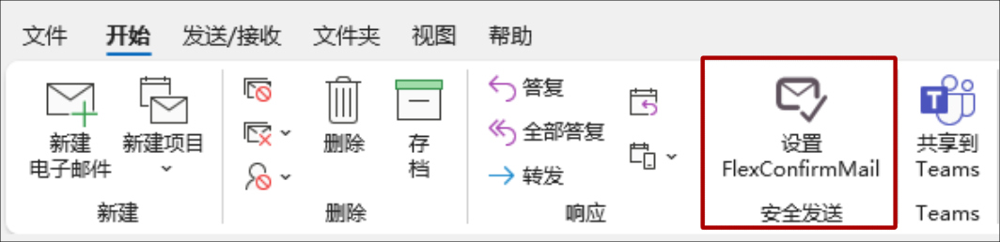
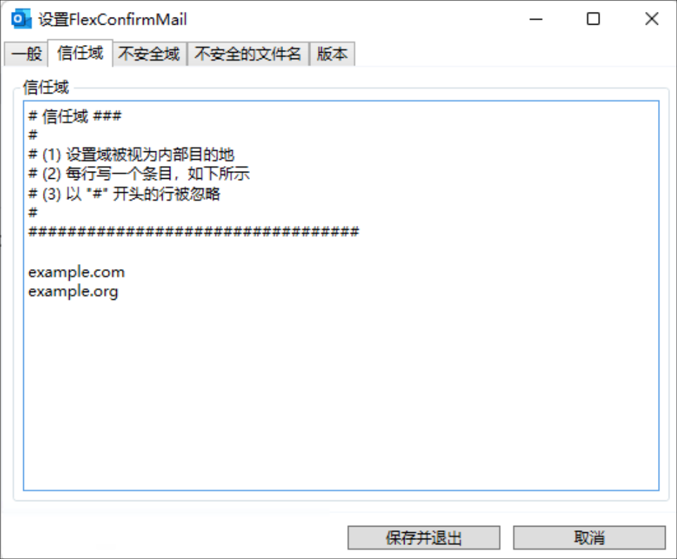
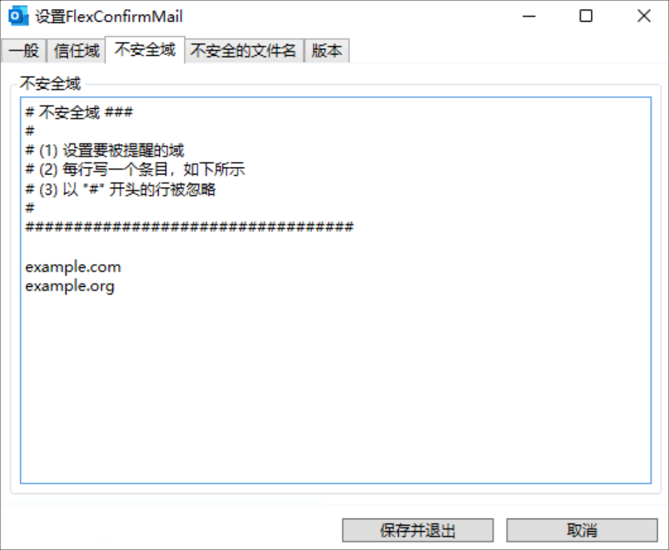
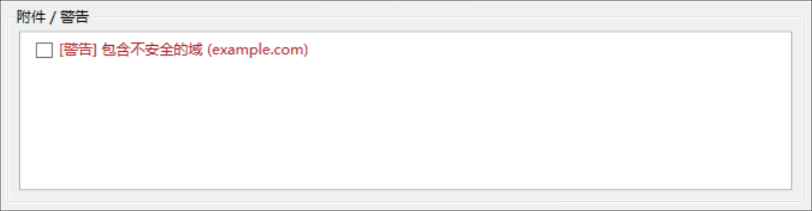
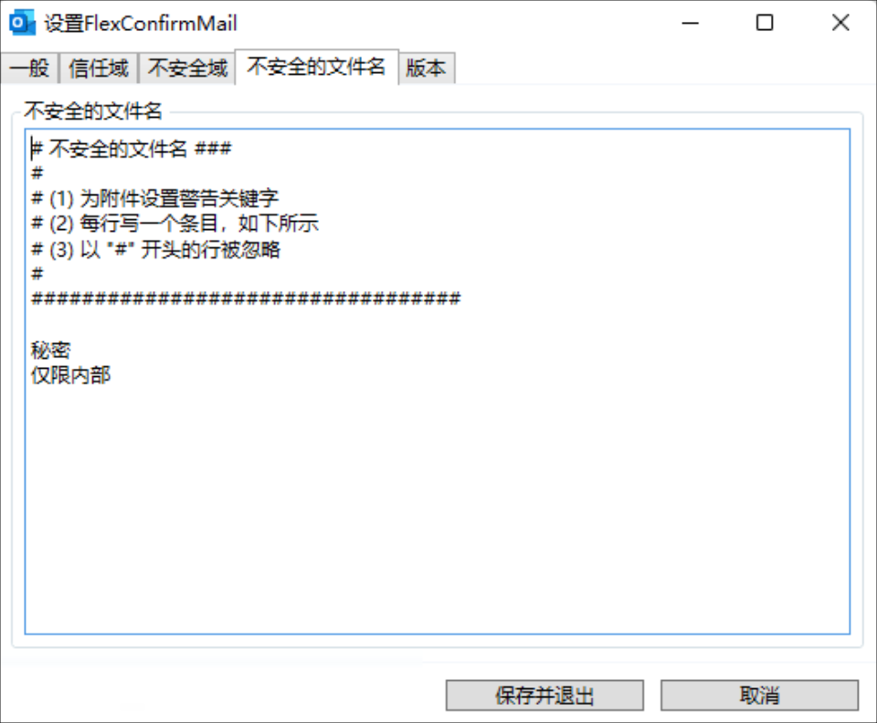
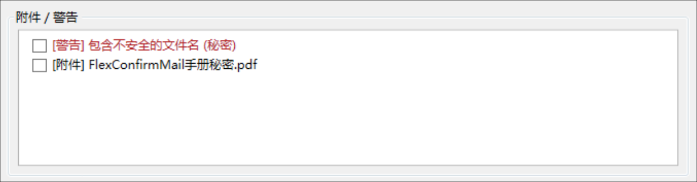

# 关于FlexConfirmMail

FlexConfirmMail for Outlook (本指南中简称为"FlexConfirmMail") 是可以防止误发邮件的开源Outlook插件。

**主要功能**

 * 在发送邮件时，将会显示一个确认收件人与附件的对话框。
 * 因为检查表的形式便于确认，所以能够有效地防止误发邮件。
 * 确认时的操作可以通过设定进行细微调整。

## 系统要求

FlexConfirmMail支持以下操作系统与软件【系统】

 | 项目             | 支持版本           |
 | ---------------- | ------------------ |
 | 操作系统         | Microsoft Windows 7/8/8.1/10/11 |
 | 应用程序         | Office 2013/2016/2019, Microsoft365 (桌面应用) |

## 软件构成

FlexConfirmMail的安装程序由以下文件组成:

| 文件                         | 内容                                |
| ---------------------------- | ----------------------------------- |
| FlexConfirmMail.dll          | FlexConfirmMail本体                 |
| FlexConfirmMail.dll.manifest | FlexConfirmMail定义文件             |
| FlexConfirmMail.vsto         | Outlook Addin定义文件               |
| fcm.ico                      | 图标文件                            |
| unins000.exe                 | 卸载程序                          |
| unins000.dat                 | 卸载程序                          |
| Microsoft.Office.Tools.Common.v4.0.Utilities.dll | VSTO DLL        |
| Microsoft.Office.Tools.Outlook.v4.0.Utilities.dll | VSTO DLL       |

\newpage

# 导入与安装

本章介绍了如何安装（和卸载）FlexConfirmMail。

## 如何安装FlexConfirmMail

1. 将FlexConfirmMail复制到终端电脑。

2. 执行安装程序并完成安装向导。

   {width=400}

3. 在菜单栏中选择 "文件>选项"，如果在有效插件一览中已显示FlexConfirmMail，表示安装成功。

   {width=400}

## 如何卸载FlexConfirmMail

 1. 从开始菜单中启动 "添加或删除程序"。

 2. 选择FlexConfirmMail并选择 "卸载"

\newpage

# 设定FlexConfirmMail

 * FlexConfirmMail的设置可以通点击功能区的图标进行变更。

   {width=400}

 * 设置文件存储在`%AppData%FlexConfirmMail`中。

## 设置社内信任域名

 1. 从Outlook的主标签页中点击 "设置FlexConfirmMail"。

 2. 点击 "信任域" 标签并添加域。

    {width=400}

 3. 点击 "保存并退出"。

## 设定需要注意的不安全域名

 1. 从Outlook的主标签页中点击 "设置FlexConfirmMail"。

 2. 点击 "不安全域" 标签并添加域。

    {width=400}

 3. 点击 "保存并退出"。

**警告示例**

{width=450}

## 设定需要注意的不安全文件名

设定需要注意的附件关键词。

 1. 从Outlook主标签页点击 "设置FlexConfirmMail"。

 2. 点击 "不安全的文件名" 标签并添加关键词。

    {width=450}

 3. 点击 "保存并退出"。

**警告示例**

{width=450}

\newpage

# 常见问题

## 如何静默安装FlexConfirmMail

在组织内的终端机中部署等情况下，需要静默安装FlexConfirmMail时（不显示任何对话框），请使用`/SILENT`选项，如下所示

```
% FlexConfirmMailSetup.exe /SILENT
```

## 如何防止FlexConfirmMail被自动禁用

Office 2013或更高版本具有自动优化功能，可能会自动禁用插件。

为了防止FlexConfirmMail被自动禁用，请在组策略中追加以下设定。

 1. 打开组策略编辑器, 点击 "用户配置"

 2. 点击 "管理模板 > Microsoft Outlook 2016 > 杂项"

 3. 点击 "托管加载项列表"

 4. 选择 "已启用" 并点击 "显示"

 5. 值的名称输入 "FlexConfirmMail" 将值设定为 "1"。

    {width=300}

 6. 点击 "确定"

关于插件自动禁用的更多细节，请阅读微软的官方文档:

https://docs.microsoft.com/zh-CN/office/vba/outlook/Concepts/Getting-Started/support-for-keeping-add-ins-enabled
